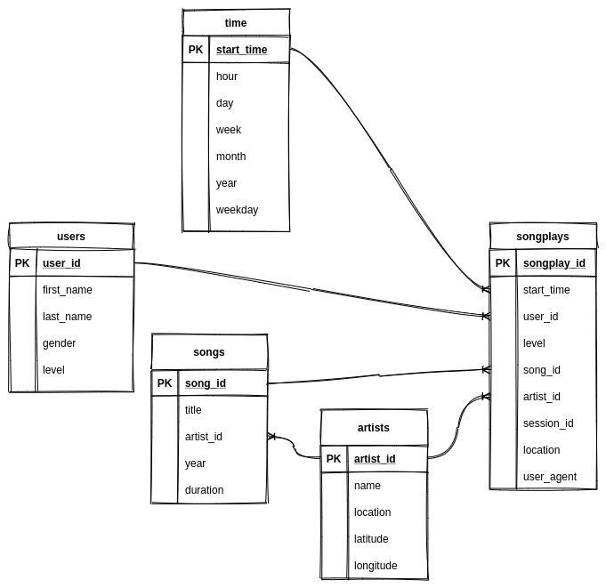

# Project: Data Lake
## Introduction
* A music streaming startup, Sparkify, has grown their user base and song database even more and want to move their data warehouse to a data lake. Their data resides in S3, in a directory of JSON logs on user activity on the app, as well as a directory with JSON metadata on the songs in their app.

* As their data engineer, you are tasked with building an ETL pipeline that extracts their data from S3, processes them using Spark, and loads the data back into S3 as a set of dimensional tables. This will allow their analytics team to continue finding insights in what songs their users are listening to.

* You'll be able to test your database and ETL pipeline by running queries given to you by the analytics team from Sparkify and compare your results with their expected results.

## Project Description
* In this project, you'll apply what you've learned on Spark and data lakes to build an ETL pipeline for a data lake hosted on S3. To complete the project, you will need to load data from S3, process the data into analytics tables using Spark, and load them back into S3. You'll deploy this Spark process on a cluster using AWS.

## My track
* First setup local Spark environment
* Do interactive way in jupyter lab, with local data.
* Transalate into `etl.py`.
* Launch Spot EMR by click-and-fill (must add hadoop, Spark in application selecction. Otherwise, no `s3-dist-cp` to mapReduce copy output from HDFS->S3)
  * too a while to get EMR in good shape:
    1. add `SSH` -> `My IP` to inbound rule of master security group.
    2. ssh to master node
    3. ssh to master node with `-ND 8157` for on-cluster service UI (hdfs, spark)
    4. create notebook to connect to this cluster
    5. submit job in SSH session: `spark-submit etl.py`
* In notebook, I can do simple business analytics as in Data Warehouse project.
* In 10-13min, the job is done, in my local machine, do `$ aws emr add-steps --cluster-id j-10HIAFUGF1OZG --steps file://./step.json`, check the Step status. It's completed in 1min.
* Here's tail log of Spark job:
```
20/09/24 05:00:26 INFO TaskSetManager: Finished task 465.0 in stage 48.0 (TID 43535) in 425 ms on ip-172-31-0-204.us-west-2.compute.internal (executor 1) (463/466)
20/09/24 05:00:27 INFO TaskSetManager: Finished task 462.0 in stage 48.0 (TID 43532) in 907 ms on ip-172-31-14-77.us-west-2.compute.internal (executor 2) (464/466)
20/09/24 05:00:27 INFO TaskSetManager: Finished task 461.0 in stage 48.0 (TID 43531) in 1350 ms on ip-172-31-14-77.us-west-2.compute.internal (executor 2) (465/466)
20/09/24 05:00:27 INFO TaskSetManager: Finished task 464.0 in stage 48.0 (TID 43534) in 1033 ms on ip-172-31-0-204.us-west-2.compute.internal (executor 1) (466/466)
20/09/24 05:00:27 INFO YarnScheduler: Removed TaskSet 48.0, whose tasks have all completed, from pool 
20/09/24 05:00:27 INFO DAGScheduler: ResultStage 48 (parquet at NativeMethodAccessorImpl.java:0) finished in 46.283 s
20/09/24 05:00:27 INFO DAGScheduler: Job 37 finished: parquet at NativeMethodAccessorImpl.java:0, took 46.295063 s
20/09/24 05:00:27 INFO FileFormatWriter: Write Job 4be76e5c-ef94-460e-a8a1-f6a0d848d605 committed.
20/09/24 05:00:27 INFO FileFormatWriter: Finished processing stats for write job 4be76e5c-ef94-460e-a8a1-f6a0d848d605.
2020-09-24 05:00:27,776 INFO  [etl] Finished process_log_data in 0:03:09.543922
2020-09-24 05:00:27,776 INFO  [etl] Total process took 0:12:22.554508
20/09/24 05:00:27 INFO SparkContext: Invoking stop() from shutdown hook
20/09/24 05:00:27 INFO SparkUI: Stopped Spark web UI at http://ip-172-31-13-69.us-west-2.compute.internal:4040
20/09/24 05:00:27 INFO YarnClientSchedulerBackend: Interrupting monitor thread
20/09/24 05:00:27 INFO YarnClientSchedulerBackend: Shutting down all executors
20/09/24 05:00:27 INFO YarnSchedulerBackend$YarnDriverEndpoint: Asking each executor to shut down
20/09/24 05:00:27 INFO SchedulerExtensionServices: Stopping SchedulerExtensionServices
(serviceOption=None,
 services=List(),
 started=false)
20/09/24 05:00:27 INFO YarnClientSchedulerBackend: Stopped
20/09/24 05:00:27 INFO MapOutputTrackerMasterEndpoint: MapOutputTrackerMasterEndpoint stopped!
20/09/24 05:00:27 INFO MemoryStore: MemoryStore cleared
20/09/24 05:00:27 INFO BlockManager: BlockManager stopped
20/09/24 05:00:27 INFO BlockManagerMaster: BlockManagerMaster stopped
20/09/24 05:00:27 INFO OutputCommitCoordinator$OutputCommitCoordinatorEndpoint: OutputCommitCoordinator stopped!
20/09/24 05:00:27 INFO SparkContext: Successfully stopped SparkContext
20/09/24 05:00:27 INFO ShutdownHookManager: Shutdown hook called
20/09/24 05:00:27 INFO ShutdownHookManager: Deleting directory /mnt/tmp/spark-80b4f635-dfe2-4c88-8abc-3313b71eb24e/pyspark-976c0531-a514-493f-864e-5b6d4fcc84e9
20/09/24 05:00:27 INFO ShutdownHookManager: Deleting directory /mnt/tmp/spark-80b4f635-dfe2-4c88-8abc-3313b71eb24e
20/09/24 05:00:27 INFO ShutdownHookManager: Deleting directory /mnt/tmp/spark-5508d52d-2e56-49c5-87e1-b5b302ac73bb
[hadoop@ip-172-31-13-69 ~]$ 
[hadoop@ip-172-31-13-69 ~]$ 
[hadoop@ip-172-31-13-69 ~]$ 
[hadoop@ip-172-31-13-69 ~]$ exit
logout
Connection to ec2-54-203-147-200.us-west-2.compute.amazonaws.com closed.

```

## Schema
* 

## Files
* etl-nb.ipynb: the 1st step notebook to interactively develop etl.py in local and EMR
* etl.py: translate etl-nb.ipynb to python file so as to spark-submit.
* step.json: s3-ds-cp HDFS -> S3.

## Hints
### Develop flow
* AWS S3 will be the data source and destination. You will read the songs and events files from AWS S3, process them into 5 tables and write the tables data back in parquet format to AWS S3 while satisfying the following requirements
    - Separate directory for each table
    - The right columns per table with the right partitioning
    - The duplicates should be handled in the proper manner.
* The data inside the workspace can be used for testing; you create the code on it instead fetching and loading from/to AWS S3. once you complete your development phase on local data, change the paths to read from and write to AWS S3.

### Project Workspace and EMR clusters
* For develop, you can do the project inside the Udacity workspace without an EMR cluster.
    * You can use the locally available data inside worksapce or use the S3 bucket of Udacity. Using the local data will be faster.
    * If you want to save the data to S3 you need to create an S3 bucket, otherwise you can write the output files locally.
    * I would recommend starting with the local and once you know that the ETL process is working as expected, then move to the S3 data.

* Exactly, you are using Spark locally. And of course, you need to create an S3 bucket on you AWS account to hold the output.

### [EMR cluster](https://knowledge.udacity.com/questions/307548)
* You are supposed to develop your code using local data in the workspace, then upload it onto the EMR master after you create the cluster on AWS.
* Once your code works on the local dir data with a single Spark local node, you can add your AWS credentials and change the input/output path to S3 (you need to create an S3 bucket for outputs), then run your code on AWS EMR.

### [Run etl.py](https://knowledge.udacity.com/questions/113108)
* choose `EMR-6.0.0` for "spark-submit" to work properly with Python 3.
* After EMR spinned, ssh to it, then do `spark-submit etl.py`.

## Local Spark Development Environment
- Download latest version (3.0.01 Sep 02,2020), package type (Pre-built for Apache Hadoop 2.7 and later), download spark: `spark-3.0.1-bin-hadoop2.7.tgz`
- Then unzip in to `/opt`, set in `~/.zshrc` for `export SPARK_HOME="/opt/spark-3.0.1-bin-hadoop2.7"`

```bash
# fxrc @ pop in ~ [13:02:30] C:130
$ sudo tar -xf ~/Downloads/spark-3.0.1-bin-hadoop2.7.tgz -C /opt/
[sudo] password for fxrc:
# fxrc @ pop in ~ [13:02:37]
$ sudo chmod -R 755 /opt/spark-3.0.1-bin-hadoop2.7
# fxrc @ pop in /opt [13:05:09]
$ . ~/.zshrc
# fxrc @ pop in /opt [13:05:15]
$ echo ${SPARK_HOME}
/opt/spark-3.0.1-bin-hadoop2.7
```

- Ready to launch Spark in standalone mode locally: `${SPARK_HOME}/sbin/start-all.sh`

```bash
# fxrc @ pop in ~/Learn/UdacityNanodegree/Udacity-Data-Engineering/Data-Lake-Spark on git:master x [13:23:45]
$ ./run.sh
starting org.apache.spark.deploy.master.Master, logging to /opt/spark-3.0.0-bin-hadoop2.7/logs/spark-fxrc-org.apache.spark.deploy.master.Master-1-pop.out
localhost: starting org.apache.spark.deploy.worker.Worker, logging to /opt/spark-3.0.0-bin-hadoop2.7/logs/spark-fxrc-org.apache.spark.deploy.worker.Worker-1-pop.out
```

- Verify it's good, according to: https://jimolonely.github.io/2019/09/15/spark/008-spark-standalone-conf-run/
    - or goto Spark UI: http://localhost:8080/
    - or use `jps` in terminal to check java process.

    ```bash
    # fxrc @ pop in ~/Learn/UdacityNanodegree/Udacity-Data-Engineering/Data-Lake-Spark on git:master x [13:24:29]
    $ jps
    800335 Jps
    7349
    798740 Worker
    798469 Master
    ```

* stop cluster by: `${SPARK_HOME}/sbin/stop-all.sh`
    * verify by `jps`
    ```
    # fxrc @ pop in ~/Learn/UdacityNanodegree/Udacity-Data-Streaming/sf-crime-data on git:master o [13:52:25]
    $ jps
    844296 Jps
    7349
    ```

### Trouble shoot
* I used Spark 3.0.1 on Hadoop 3.2, then I switch back to Hadoop 2.7 package, then it showed.
* I got answer from git issue: https://github.com/foundweekends/giter8/issues/11#issuecomment-1551587, https://github.com/archivesunleashed/aut/issues/242#issuecomment-405365595.
* Need to delete `~/.m2/repository` in addition to `~/.ivy2` worked for me, it'll have clean packages.
```
:: USE VERBOSE OR DEBUG MESSAGE LEVEL FOR MORE DETAILS
Exception in thread "main" java.lang.RuntimeException: [download failed: asm#asm;3.2!asm.jar, download failed: org.apache.httpcomponents#httpcore;4.2.5!httpcore.jar, download failed: com.google.protobuf#protobuf-java;2.5.0!protobuf-java.jar(bundle)]
        at org.apache.spark.deploy.SparkSubmitUtils$.resolveMavenCoordinates(SparkSubmit.scala:1389)
        at org.apache.spark.deploy.DependencyUtils$.resolveMavenDependencies(DependencyUtils.scala:54)
        at org.apache.spark.deploy.SparkSubmit.prepareSubmitEnvironment(SparkSubmit.scala:308)
        at org.apache.spark.deploy.SparkSubmit.org$apache$spark$deploy$SparkSubmit$$runMain(SparkSubmit.scala:871)
        at org.apache.spark.deploy.SparkSubmit.doRunMain$1(SparkSubmit.scala:180)
        at org.apache.spark.deploy.SparkSubmit.submit(SparkSubmit.scala:203)
        at org.apache.spark.deploy.SparkSubmit.doSubmit(SparkSubmit.scala:90)
        at org.apache.spark.deploy.SparkSubmit$$anon$2.doSubmit(SparkSubmit.scala:1007)
        at org.apache.spark.deploy.SparkSubmit$.main(SparkSubmit.scala:1016)
        at org.apache.spark.deploy.SparkSubmit.main(SparkSubmit.scala)
Traceback (most recent call last):
  File "etl.py", line 97, in <module>
    main()
  File "etl.py", line 87, in main
    spark = create_spark_session()
  File "etl.py", line 19, in create_spark_session
    spark = SparkSession \
  File "/home/fxrc/miniconda3/envs/mypy3/lib/python3.8/site-packages/pyspark/sql/session.py", line 186, in getOrCreate
    sc = SparkContext.getOrCreate(sparkConf)
  File "/home/fxrc/miniconda3/envs/mypy3/lib/python3.8/site-packages/pyspark/context.py", line 371, in getOrCreate
    SparkContext(conf=conf or SparkConf())
  File "/home/fxrc/miniconda3/envs/mypy3/lib/python3.8/site-packages/pyspark/context.py", line 128, in __init__
    SparkContext._ensure_initialized(self, gateway=gateway, conf=conf)
  File "/home/fxrc/miniconda3/envs/mypy3/lib/python3.8/site-packages/pyspark/context.py", line 320, in _ensure_initialized
    SparkContext._gateway = gateway or launch_gateway(conf)
  File "/home/fxrc/miniconda3/envs/mypy3/lib/python3.8/site-packages/pyspark/java_gateway.py", line 105, in launch_gateway
    raise Exception("Java gateway process exited before sending its port number")
Exception: Java gateway process exited before sending its port number
```