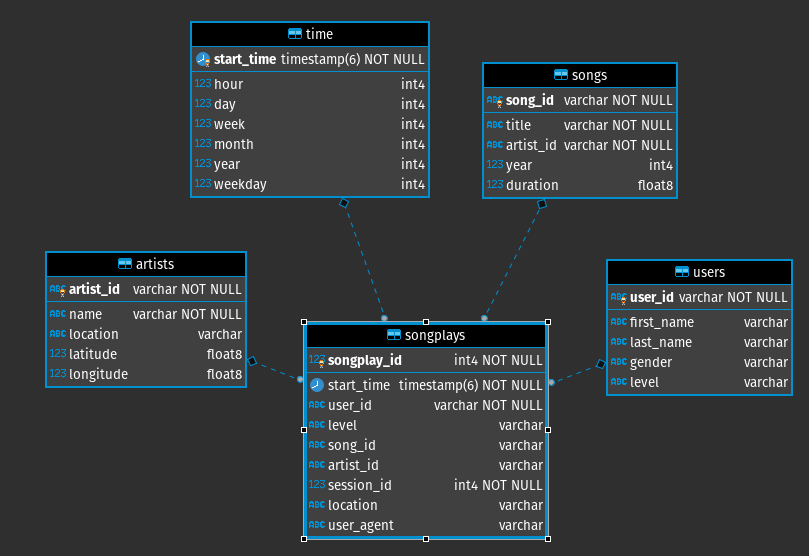
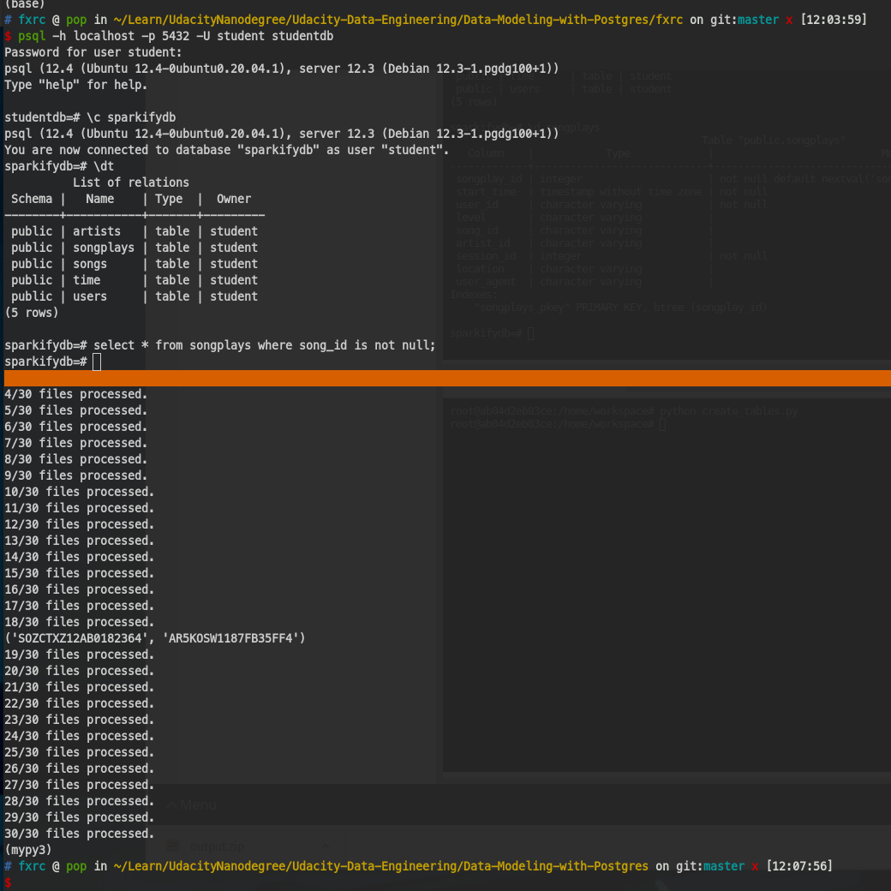

# Data Modeling with Postgres

## Q&A
### Discuss the purpose of this database in the context of the startup, Sparkify, and their analytical goals.
* There're 5 tables created in Sparkifydb, relations retrieved from song.json and log.json
* fact:
    1. songplays - records in log data associated with song plays i.e. records with page NextSong
        * attr: songplay_id, start_time, user_id, level, song_id, artist_id, session_id, location, user_agent
* Dim:
    1. users - users in the app
        * attr: user_id, first_name, last_name, gender, level
    2. songs - songs in music database
        * attr: song_id, title, artist_id, year, duration
    3. artists - artists in music database
        * attr: artist_id, name, location, latitude, longitude
    4. time - timestamps of records in songplays broken down into specific units
        * attr:start_time, hour, day, week, month, year, weekday


### State and justify your database schema design and ETL pipeline.
* ER Diagram from DBeaver: 
* ETL pipeline: to retrieve proper data from song.json and log.json to insert into fact and dimension tables.
* So that we can easily query songplays table, rather real timely join all 4 dimention tables. This improves query throughput and data integrity.
### [Optional] Provide example queries and results for song play analysis.
* find songplays with valid song/artistid: `select * from songplays where song_id is not null;`
* find distinct users in songplays: `select distinct (user_id) from songplays`
* count distinct users in songplays: `select count(distinct (user_id)) from songplays`
* find active user stat, and top3: 49,80,97.
    ```sql
    SELECT user_id, COUNT(*) user_rank
    FROM songplays GROUP BY user_id
    ORDER BY user_rank DESC;
    ```
* most popular state with user actions, top 3: CA, MI, WI
    ```sql
    select subb.state, SUM(subb.user_action) as state_rank from
    (SELECT user_id, right (s.location,2) as state, COUNT(*) user_action
    FROM songplays s
    GROUP BY user_id, s.location
    ORDER BY user_action desc) as subb
    group by subb.state
    order by state_rank desc
    ```

---

## Project Directions
### Create Tables
* finish `sql_queries.py`, then call `create_tables.py`, and verify by `test.ipynb`.

### Build ETL process
* rerun `create_tables.py` to reset tables before notebooks.
* easy and plain `etl.ipynb`, it only fetches one json, and it's quick verify meant. Then test with `test.ipynb`.

### Build ETL pipeline
* then reproduce what we did in `etl.ipynb` in `etl.py`.
* always run `create_tables.py` before `etl.py`.
* I can also use psql to debug, easier than in py. 

### Result:
* There's only 1 unique songplays that has non-null songid & artistid.
```
15/30 files processed.
16/30 files processed.
17/30 files processed.
18/30 files processed.
songid: SOZCTXZ12AB0182364, artistid: AR5KOSW1187FB35FF4
19/30 files processed.
20/30 files processed.
21/30 files processed.
22/30 files processed.

```
* found a **BUG** in `etl.[py/ipynb]` ,and reported in forum: https://knowledge.udacity.com/questions/48698
```
Because psycopg2 cur.execute() always return None! If a query was executed, the returned values can be retrieved using fetch*() methods.
according to doc: https://www.psycopg.org/docs/cursor.html#cursor.execute.
```

## Datasets
* Log Dataset: ['artist', 'auth', 'firstName', 'gender', 'itemInSession', 'lastName',
       'length', 'level', 'location', 'method', 'page', 'registration',
       'sessionId', 'song', 'status', 'ts', 'userAgent', 'userId']

```json
{
    "artist": "Quad City DJ's",
    "auth": "Logged In",
    "firstName": "Chloe",
    "gender": "F",
    "itemInSession": 0,
    "lastName": "Cuevas",
    "length": 451.44771,
    "level": "free",
    "location": "San Francisco-Oakland-Hayward, CA",
    "method": "PUT",
    "page": "NextSong",
    "registration": 1540940782796.0,
    "sessionId": 506,
    "song": "C'mon N' Ride It (The Train) (LP Version)",
    "status": 200,
    "ts": 1542081112796,
    "userAgent": "Mozilla\/5.0 (Windows NT 5.1; rv:31.0) Gecko\/20100101 Firefox\/31.0",
    "userId": "49"
}
```
* Song Dataset: ['artist_id', 'artist_latitude', 'artist_location', 'artist_longitude',
       'artist_name', 'duration', 'num_songs', 'song_id', 'title', 'year']

```json
{
    "num_songs": 1,
    "artist_id": "ARJIE2Y1187B994AB7",
    "artist_latitude": null,
    "artist_longitude": null,
    "artist_location": "",
    "artist_name": "Line Renaud",
    "song_id": "SOUPIRU12A6D4FA1E1",
    "title": "Der Kleine Dompfaff",
    "duration": 152.92036,
    "year": 0
}
```

## Local environment setup
* I use docker-compose to launch postgres, and cassandra.
* `docker-compose up --force-recreate` to launch
* `docker-compose down` to clean

## Datasets
* due to jupyter lab's whatever limit, I can't download data folder from workspace.
* as Himanshu's answer in: https://knowledge.udacity.com/questions/300378#300404, simply did `zip -r output.zip data`. So I can download this zip file.
* however, right click on the file shows chrome menu rather jupyterlab menu, as suggested in SOF: https://stackoverflow.com/questions/54915250/clicking-does-not-work-in-jupyterlab-os-x-chrome, it's due to extension: `Right-to-Copy`. I disabled it and right clicks works now!