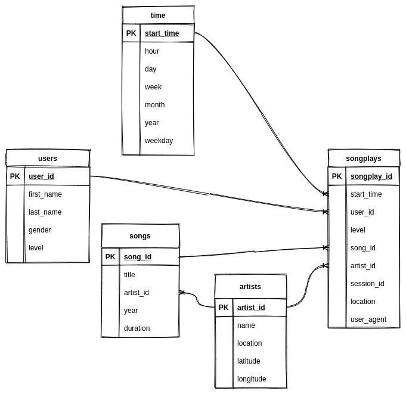

# Data Pipelines with Airflow

## Intro
* A music streaming company, Sparkify, has decided that it is time to introduce more automation and monitoring to their data warehouse ETL pipelines and come to the conclusion that the best tool to achieve this is Apache Airflow.

* They have decided to bring you into the project and expect you to create high grade data pipelines that are dynamic and built from reusable tasks, can be monitored, and allow easy backfills. They have also noted that the data quality plays a big part when analyses are executed on top the data warehouse and want to run tests against their datasets after the ETL steps have been executed to catch any discrepancies in the datasets.

* The source data resides in S3 and needs to be processed in Sparkify's data warehouse in Amazon Redshift. The source datasets consist of JSON logs that tell about user activity in the application and JSON metadata about the songs the users listen to.

## Overview
* This project will introduce you to the core concepts of Apache Airflow. To complete the project, you will need to create your own custom operators to perform tasks such as staging the data, filling the data warehouse, and running checks on the data as the final step.

* We have provided you with a project template that takes care of all the imports and provides four empty operators that need to be implemented into functional pieces of a data pipeline. The template also contains a set of tasks that need to be linked to achieve a coherent and sensible data flow within the pipeline.

* You'll be provided with a helpers class that contains all the SQL transformations. Thus, you won't need to write the ETL yourselves, but you'll need to execute it with your custom operators.

## Star schema


## Steps
### AWS Redshift creation
* using `setup-cluster.ipynb` to launch a new 4 node d2.large Redshift cluster.
    * copy endpoint and role ARN.
    * run Project 2's `create_table.py` to DROP tables, then CREATE 5 tables in redshift.

## Airflow config
* On the create connection page, enter the following values. Once you've entered these values, select Save and Add Another.
```
Conn Id: Enter aws_credentials.
Conn Type: Enter Amazon Web Services.
Login: Enter your Access key ID from the IAM User credentials you downloaded earlier.
Password: Enter your Secret access key from the IAM User credentials you downloaded earlier.
```
* On the next create connection page, enter the following values:
```
Conn Id: Enter redshift.
Conn Type: Enter Postgres.
Host: Enter the endpoint of your Redshift cluster, excluding the port at the end. You can find this by selecting your cluster in the Clusters page of the Amazon Redshift console. See where this is located in the screenshot below. IMPORTANT: Make sure to NOT include the port at the end of the Redshift endpoint string.
Schema: Enter dev. This is the Redshift database you want to connect to.
Login: Enter awsuser.
Password: Enter the password you created when launching your Redshift cluster.
Port: Enter 5439.
```

## Issues