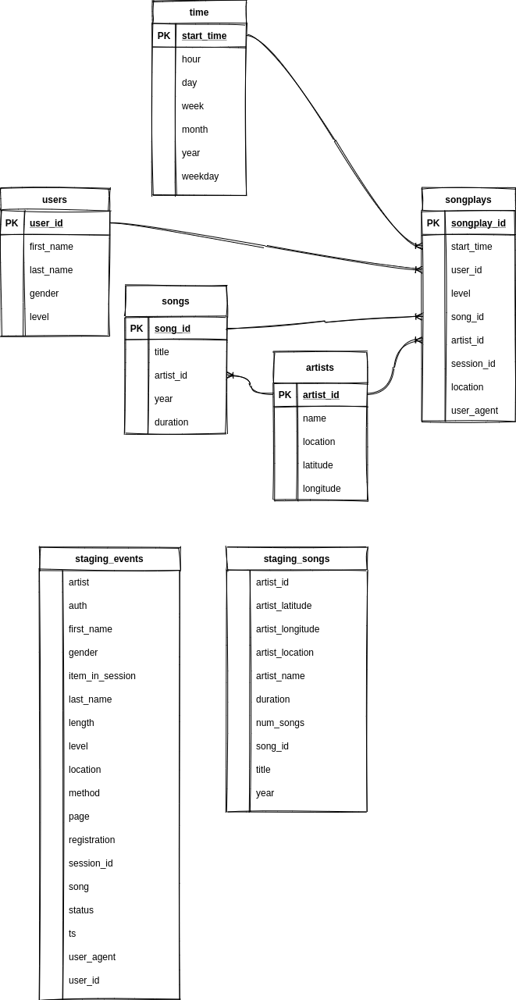

# Data Warehouse with AWS Redshift

## Introduction
* A music streaming startup, Sparkify, has grown their user base and song database and want to move their processes and data onto the cloud. Their data resides in S3, in a directory of JSON logs on user activity on the app, as well as a directory with JSON metadata on the songs in their app.

* As their data engineer, you are tasked with building an ETL pipeline that extracts their data from S3, stages them in Redshift, and transforms data into a set of dimensional tables for their analytics team to continue finding insights in what songs their users are listening to. You'll be able to test your database and ETL pipeline by running queries given to you by the analytics team from Sparkify and compare your results with their expected results.

## Project Description
* In this project, you'll apply what you've learned on data warehouses and AWS to build an ETL pipeline for a database hosted on Redshift. To complete the project, you will need to load data from S3 to staging tables on Redshift and execute SQL statements that create the analytics tables from these staging tables.

## Schema for Song Play Analysis
* Using the song and event datasets, you'll need to create a star schema optimized for queries on song play analysis. This includes the following tables.

### Fact Table
1. songplays - records in event data associated with song plays i.e. records with page NextSong
    * songplay_id, start_time, user_id, level, song_id, artist_id, session_id, location, user_agent

### Dimension Tables
1. users - users in the app
    * user_id, first_name, last_name, gender, level
2. songs - songs in music database
    * song_id, title, artist_id, year, duration
3. artists - artists in music database
    * artist_id, name, location, lattitude, longitude
4. time - timestamps of records in songplays broken down into specific units
    * start_time, hour, day, week, month, year, weekday

### SQL
* ERD: 
* sql:
```sql
CREATE TABLE IF NOT EXISTS staging_events
(
    artist          VARCHAR   NULL,
    auth            VARCHAR   NULL,
    first_name      VARCHAR   NULL,
    gender          VARCHAR   NULL,
    item_in_session INTEGER   NULL,
    last_name       VARCHAR   NULL,
    length          FLOAT     NULL,
    level           VARCHAR   NULL,
    location        VARCHAR   NULL,
    method          VARCHAR   NULL,
    page            VARCHAR   NULL,
    registration    FLOAT     NULL,
    session_id      INTEGER   NOT NULL,
    song            VARCHAR   NULL,
    status          INTEGER   NULL,
    ts              TIMESTAMP NOT NULL,
    user_agent      VARCHAR   NULL,
    user_id         INTEGER   NULL
);

CREATE TABLE IF NOT EXISTS staging_songs
(
    artist_id        VARCHAR NOT NULL,
    artist_latitude  FLOAT   NULL,
    artist_longitude FLOAT   NULL,
    artist_location  VARCHAR NULL,
    artist_name      VARCHAR NULL,
    duration         FLOAT   NULL,
    num_songs        INTEGER NULL,
    song_id          VARCHAR NOT NULL,
    title            VARCHAR NULL,
    year             INTEGER NULL
);

CREATE TABLE IF NOT EXISTS users
(
    user_id    INTEGER NOT NULL sortkey,
    first_name VARCHAR NULL,
    last_name  VARCHAR NULL,
    gender     VARCHAR NULL,
    level      VARCHAR NULL,
    PRIMARY KEY (user_id)
);

CREATE TABLE IF NOT EXISTS songs
(
    song_id   VARCHAR NOT NULL sortkey,
    title     VARCHAR NOT NULL,
    artist_id VARCHAR NOT NULL,
    year      INTEGER NOT NULL,
    duration  FLOAT   NOT NULL,
    PRIMARY KEY (song_id),
    FOREIGN KEY (artist_id) REFERENCES artists (artist_id)
);

CREATE TABLE IF NOT EXISTS artists
(
    artist_id VARCHAR NOT NULL sortkey,
    name      VARCHAR NULL,
    location  VARCHAR NULL,
    latitude  NUMERIC NULL,
    longitude NUMERIC NULL,
    PRIMARY KEY (artist_id)
);

CREATE TABLE IF NOT EXISTS time
(
    start_time TIMESTAMP NOT NULL sortkey distkey,
    hour       SMALLINT  NULL,
    day        SMALLINT  NULL,
    week       SMALLINT  NULL,
    month      SMALLINT  NULL,
    year       SMALLINT  NULL,
    weekday    SMALLINT  NULL,
    PRIMARY KEY (start_time)
);

CREATE TABLE IF NOT EXISTS songplays
(
    songplay_id INTEGER IDENTITY (0,1) NOT NULL,
    start_time  TIMESTAMP              NOT NULL sortkey distkey,
    user_id     INTEGER                NOT NULL,
    level       VARCHAR                NOT NULL,
    song_id     VARCHAR                NOT NULL,
    artist_id   VARCHAR                NOT NULL,
    session_id  INTEGER                NOT NULL,
    location    VARCHAR                NULL,
    user_agent  VARCHAR                NULL,
    PRIMARY KEY (songplay_id),
    FOREIGN KEY (start_time) REFERENCES time (start_time),
    FOREIGN KEY (user_id) REFERENCES users (user_id),
    FOREIGN KEY (song_id) REFERENCES songs (song_id),
    FOREIGN KEY (artist_id) REFERENCES artists (artist_id)
);
```

## The project template includes four files:
1. `create_table.py` is where you'll create your fact and dimension tables for the star schema in Redshift.
2. `etl.py` is where you'll load data from S3 into staging tables on Redshift and then process that data into your analytics tables on Redshift.
3. `sql_queries.py` is where you'll define you SQL statements, which will be imported into the two other files above.
4. `README.md` is where you'll provide discussion on your process and decisions for this ETL pipeline.

## Project Steps
a. Create Table Schemas
1. Design schemas for your fact and dimension tables
2. Write a SQL `CREATE` statement for each of these tables in `sql_queries.py`
3. Complete the logic in `create_tables.py` to connect to the database and create these tables
4. Write SQL `DROP` statements to drop tables in the beginning of `create_tables.py` if the tables already exist. This way, you can run `create_tables.py` whenever you want to reset your database and test your ETL pipeline.
5. Launch a redshift cluster and create an IAM role that has read access to S3.
6. Add redshift database and IAM role info to `dwh.cfg`.
7. Test by running `create_tables.py` and checking the table schemas in your redshift database. You can use Query Editor in the AWS Redshift console for this.

b. Build ETL Pipeline
1. Implement the logic in `etl.py` to load data from S3 to staging tables on Redshift.
2. Implement the logic in `etl.py` to load data from staging tables to analytics tables on Redshift.
3. Test by running `etl.py` after running `create_tables.py` and running the analytic queries on your Redshift database to compare your results with the expected results.
4. Delete your redshift cluster when finished.

c. Document Process (in `README.md`)
1. Discuss the purpose of this database in context of the startup, Sparkify, and their analytical goals.
2. State and justify your database schema design and ETL pipeline.
3. [Optional] Provide example queries and results for song play analysis.

## Note
* The `SERIAL` command in Postgres is not supported in Redshift. The equivalent in redshift is `IDENTITY(0,1)`, which you can read more on in the Redshift Create Table Docs.

## My Steps
### Understand data
* use IaC ipynb to check udacity-dend s3 for song, event json, then download via aws-cli in terminal: `aws s3 cp s3://udacity-dend/log_data/2018/11/2018-11-01-events.json .`.
    * I had further copied 1 song data/Log data into samples folder.

### setup-cluster notebook
* mimic Exericse IaC to manage cluster, check data.
* after cluster created, copy-paste endpoint and iam to `dwh.cfg`.

### sql_queries.py
* change in dwh.cfg
    * use `song_data` rather `song-data`, same as `log_data`. Because these are subdirectories of bigger ones.
* finish DROP, CREATE table in sql_queries, then run `python create_tables.py` in terminal (use launcher in Jupyter Lab).
    * if got errors, goto Amazon Redshift -> 'Queries and loads(27)', to see errors and fix in sql_quries.py
* Continue finish staging, insert queries.

* run `python create_tables.py`
* run `python etl.py`

## Analysis
* Check Redshift console for progress of create_tables or etl.
* When it's done. (create_tables + etl takes about 8min)
* Then we can do sql query on fact + dim tables

### popular artist
```sql
%%sql
select a.name, count(*)
from artists a
join songplays sp
on a.artist_id = sp.artist_id
group by 1
order by 2 desc
limit 3
```
**name**|**count**
:-----:|:-----:
Dwight Yoakam|37
Kid Cudi / Kanye West / Common|10
Kid Cudi|10

### most popular song
```sql
%%sql
select s.title, a.name, count(*)
from songs s
join songplays sp
on s.song_id = sp.song_id
join artists a
on a.artist_id = sp.artist_id
group by 1,2
order by 3 desc
limit 3
```
**title**|**name**|**count**
:-----:|:-----:|:-----:
You're The One|Dwight Yoakam|37
Catch You Baby (Steve Pitron & Max Sanna Radio Edit)|Lonnie Gordon|9
I CAN'T GET STARTED|Ron Carter|9
